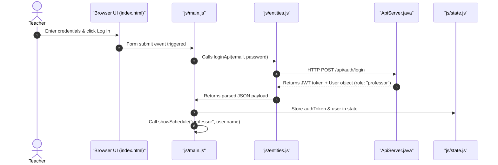
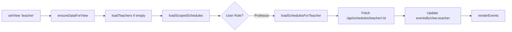
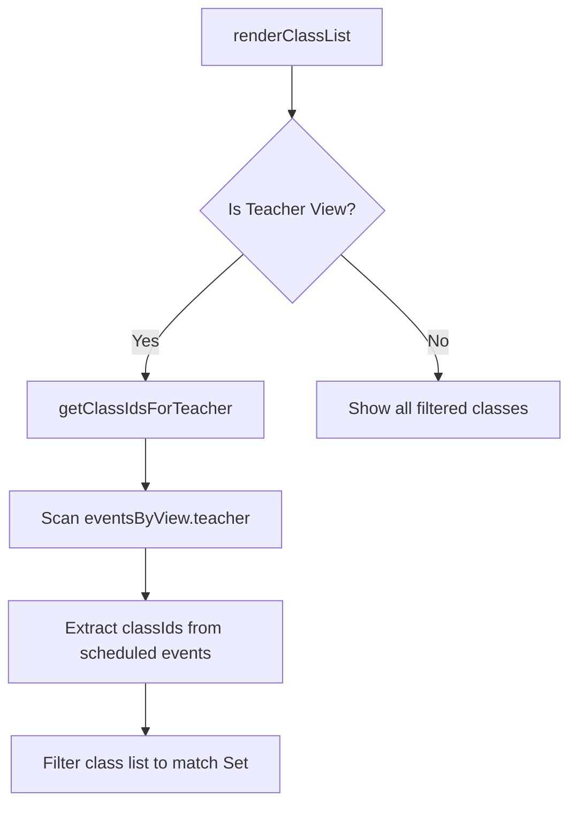

# Teacher Login & Scheduling Frontend Documentation

This guide provides a comprehensive walkthrough of the frontend architecture, code files, functions, and state changes related to the **Teacher (Professor) Login** workflow. It details how the client authenticates a teacher, adapts the user interface, retrieves their schedule, and handles advanced scheduling overlays (the SMART feature).

---

## 1. Authentication & Session Setup

When a teacher logs in, the client handles the request, saves the security token, and redirects them to their specialized schedule view.



### Key Functions & Event Wires:
1.  **Form Listener ([js/main.js](../src/main/resources/public/js/main.js))**:
    The login form submission is captured inside `bindEvents()`. It extracts the `email` and `password` fields from the HTML form and triggers the asynchronous API request.
2.  **API Handler ([js/entities.js](../src/main/resources/public/js/entities.js))**:
    - `loginApi(email, password)` makes a POST request to `/api/auth/login`.
    - Upon success, `applyAuthenticatedSession(token, user)` is called to save the JSON Web Token (JWT) in local state (`state.authToken`) and cache it in the browser's storage (`sms.session`) for persistent logins.

---

## 2. Syncing the Teacher Context

In the system, **Users** and **Teachers** are stored in separate tables. A logged-in User has a `user.id`, but their scheduling queries require a `teacher.id` (linked profile).

To resolve this, the client matches the User record against the loaded Teacher profile registry:

```javascript
// Located in js/main.js
function syncCurrentTeacherContext() {
    state.currentTeacherId = null;
    state.defaultCourseId = null;

    if (!isTeacherRole(state.role) || !state.currentUser) {
        return;
    }

    // Lookup matching profile where teacher.userId equals logged-in user.id
    const matchedTeacher = (teacherDirectory || []).find(
        (teacher) => Number(teacher.userId) === Number(state.currentUser.id)
    );
    if (!matchedTeacher) {
        return;
    }

    state.currentTeacherId = matchedTeacher.id; // Profile ID stored
    
    // Auto-resolve default course taught by this teacher for bookings
    const teacherEvent = (eventsByView.teacher || []).find(
        (eventItem) =>
            String(eventItem.teacherId) === String(state.currentTeacherId) &&
            eventItem.courseId
    );
    state.defaultCourseId = teacherEvent ? Number(teacherEvent.courseId) : null;
}
```

---

## 3. UI Adaptation: Modifying Controls & Navigation Tabs

As soon as `showSchedule("professor", name)` is called, the frontend configures the screen layout specifically for teachers:

1.  **Tab Re-ordering ([js/views.js](../src/main/resources/public/js/views.js))**:
    - The **Teacher Schedule** tab is made visible (`teacherTab.classList.remove("hidden")`).
    - The tab is physically inserted at the very beginning of the tab list container (`scheduleTabs.insertBefore(teacherTab, classTab)`) so it is the default screen.
2.  **Tab Restriction**:
    - The **User Directory** tab (`userTab`) remains hidden (only visible to role `"admin"`).
    - The **Audit Log** tab (`auditTab`) is hidden.
    - The guest disclaimer text (`guestNote`) is hidden since the teacher has full scheduling access.
3.  **Automatic Redirection**:
    - The app automatically changes the active view state to the teacher calendar (`setView("teacher")`).

---

## 4. Timetable Fetching & Filtering

Unlike administrators who fetch all system schedules at once, the teacher client leverages **scoped schedule loading** to minimize network transfer.



### Loading Scoped Timetables ([js/entities.js](../src/main/resources/public/js/entities.js)):
*   When a professor selects the teacher view, the client calls `loadSchedulesForTeacher(state.currentTeacherId)`.
*   This makes an HTTP request to `/api/schedules/teacher/{id}`.
*   The backend responds with schedule events associated with that specific teacher profile ID.

### Rendering Grid Events ([js/schedule.js](../src/main/resources/public/js/schedule.js)):
*   In `renderEvents()`, schedule events are dynamically filtered by comparing properties:
    ```javascript
    if (state.view === "teacher" && state.selectedTeacherId) {
      filteredItems = items.filter(
        (item) =>
          String(item.teacherId) === String(state.selectedTeacherId) ||
          String(item.professor) === String(state.selectedTeacherId)
      );
    }
    ```
*   The resulting items are positioned vertically inside the day column containers.

---

## 5. The "SMART" Overlay Feature (Timetable Comparison)

The **SMART** button (visible only to admins and teachers in the teacher view) allows a teacher to overlay class timetables directly onto their personal schedule to detect booking openings or conflicts.

```
+---------------------------------------+
|  SMART Button Clicked                 |
+-------------------+-------------------+
                    |
                    v
+-------------------+-------------------+
|  Show Smart Overlay Modal            |
|  - Select target class list (e.g. SE-1A)|
+-------------------+-------------------+
                    |
                    v
+-------------------+-------------------+
|  applySmartOverlaySelection()         |
|  - Fetch target class schedules       |
|  - Merge events on schedule grid      |
|  - Enable state.smartOverlayEnabled   |
+-------------------+-------------------+
```

### Trigger Flow:
1.  **Overlay Configuration**:
    When clicked, `openSmartOverlayModal()` maps the active teacher ID to `state.smartOverlayTeacherId` and populates the checklist of classes (`renderSmartOverlayClassOptions()`).
2.  **Schedule Aggregation**:
    When the teacher selects target classes and clicks **Show Overlay**, `applySmartOverlaySelection()` triggers:
    ```javascript
    const promises = selectedClassIds.map((classId) => loadSchedulesForClass(classId));
    const results = await Promise.all(promises);
    eventsByView.class = results.flat(); // Merge class schedules into view array
    ```
3.  **Render Flag**:
    `state.smartOverlayEnabled` is set to `true`. The calendar grid redraws. In this mode, both the teacher's schedule and the target class timetables render concurrently, highlighting occupied blocks.

---

## 6. Smart Booking & Conflict Prevention

While standard booking requires manual entry of target classrooms, class names, and professor names, **Smart Booking** leverages the active overlay context to streamline scheduling.

### Triggering Modal:
*   When a teacher clicks an empty space in the schedule grid under overlay mode:
    `openBookingModal(dayIndex, startMinutes, null, { smartMode: true })` is called.

### Adaptation Logic:
*   **Automatic Values**:
    - **Classes**: Automatically pre-selected to match the classes currently loaded in the overlay (`state.smartOverlayClassIds`).
    - **Professor**: Prefilled with the teacher's profile (`state.currentTeacherId`).
    - **Times**: Automatically rounded to the clicked 2-hour standard slot grid.
*   **Disabled Form Inputs**:
    - The individual Class and Professor search bars are hidden/disabled because they are implicitly set by the SMART context.
*   **Backend Validation**:
    When the teacher clicks **Book**, the JSON payload is dispatched to `POST /api/schedules`. The Javalin server runs double-booking checks in the database schema before returning a confirmation or throwing a validation conflict error (which is caught and shown as an alert in the browser).

---

## 7. Rendering Class & Room Schedule Lists

When a user selects a Class or a Room, the interface goes through a multi-step process to load and draw the associated schedules.

### A. How a Class Schedule List Renders
1.  **View Triggers**:
    *   When the user switches to the "Class Schedule" tab, the view state updates, and `setView("class")` (in [js/views.js](../src/main/resources/public/js/views.js)) triggers.
2.  **Listing rendering**:
    *   `renderClassList()` (in [js/dom.js](../src/main/resources/public/js/dom.js)) gets all classes from the local cache using `getFilteredClasses()`.
    *   It clears the HTML inside `#class-list` and constructs HTML elements (`.class-row` cards) displaying the class name, ID, year, and semester tags.
3.  **Selection & Event Fetching**:
    *   Clicking a row triggers `selectClass(classId)` (in [js/dom.js](../src/main/resources/public/js/dom.js)).
    *   This sets `state.selectedClassId = classId`, fetches schedules from the backend via `loadSchedulesForClass(classId)`, and caches them inside `eventsByView.class`.
4.  **Drawing the Timetable**:
    *   `renderEvents()` (in [js/schedule.js](../src/main/resources/public/js/schedule.js)) is executed.
    *   It filters events matching the class ID, clears the `#events` container, and draws schedule cards. It positions them using CSS styling variables (top offset and height computed by `minutesFromStart`).

### B. How a Room Schedule List Renders
1.  **View Triggers**:
    *   Selecting the "Room Schedule" tab fires `setView("room")`.
2.  **Listing rendering**:
    *   `renderRoomList()` (in [js/dom.js](../src/main/resources/public/js/dom.js)) gets classrooms via `getFilteredRooms()`.
    *   It clears the HTML inside `#room-list` and generates `.room-row` elements displaying the room name, building name, floor level, capacity, and edit triggers.
3.  **Selection & Event Fetching**:
    *   Clicking a room row triggers `selectRoom(roomId)` (in [js/dom.js](../src/main/resources/public/js/dom.js)).
    *   This sets `state.selectedRoomId = roomId`, calls `loadSchedulesForRoom(roomId)` (sending a request to `GET /api/schedules/room/{id}`), and updates `eventsByView.room`.
4.  **Drawing the Timetable**:
    *   `renderEvents()` filters events where `item.roomId` matches `state.selectedRoomId`, and dynamically draws the event cards in the room calendar grid.

---

## 8. Filtering the Class List for Teachers

When a teacher is logged in (or an admin views a teacher schedule), they shouldn't see every class in the institution. Instead, the class sidebar list is automatically filtered to show **only the classes they teach**.

This is implemented via a combination of event caching and list mapping:



### Steps & JavaScript Code Flow:
1.  **Teacher Event Caching**:
    *   When the teacher logs in, their schedule data is fetched and stored in `eventsByView.teacher`.
2.  **Analyzing Classes Taught**:
    *   In [js/dom.js](../src/main/resources/public/js/dom.js), `renderClassList()` invokes `getClassIdsForTeacher(effectiveTeacherId)`:
    ```javascript
    function getClassIdsForTeacher(teacherId) {
      if (!teacherId) return new Set();

      // Scan all events in the teacher's schedule to find their assigned hours
      const scheduleItems = (eventsByView.teacher || []).filter((item) => {
        return (
          String(item.teacherId) === String(teacherId) ||
          String(item.professor) === String(teacherId)
        );
      });

      // Extract all distinct Class IDs from those events
      const classIds = new Set();
      scheduleItems.forEach((item) => {
        if (Array.isArray(item.classIds) && item.classIds.length > 0) {
          item.classIds.forEach((classId) => classIds.add(Number(classId)));
        } else if (item.classId != null) {
          classIds.add(Number(item.classId));
        }
      });
      return classIds;
    }
    ```
3.  **Applying the Filter**:
    *   In `renderClassList()`, if the active screen shows a teacher timetabling view, it filters the available classes list:
    ```javascript
    if (isTeacherScheduleView || isTeacherClassView) {
      const teacherClassIds = getClassIdsForTeacher(effectiveTeacherId);
      classes = classes.filter((classItem) => teacherClassIds.has(Number(classItem.id)));
    }
    ```
    *   This guarantees the teacher only sees navigation options for classes where they are registered to teach.

